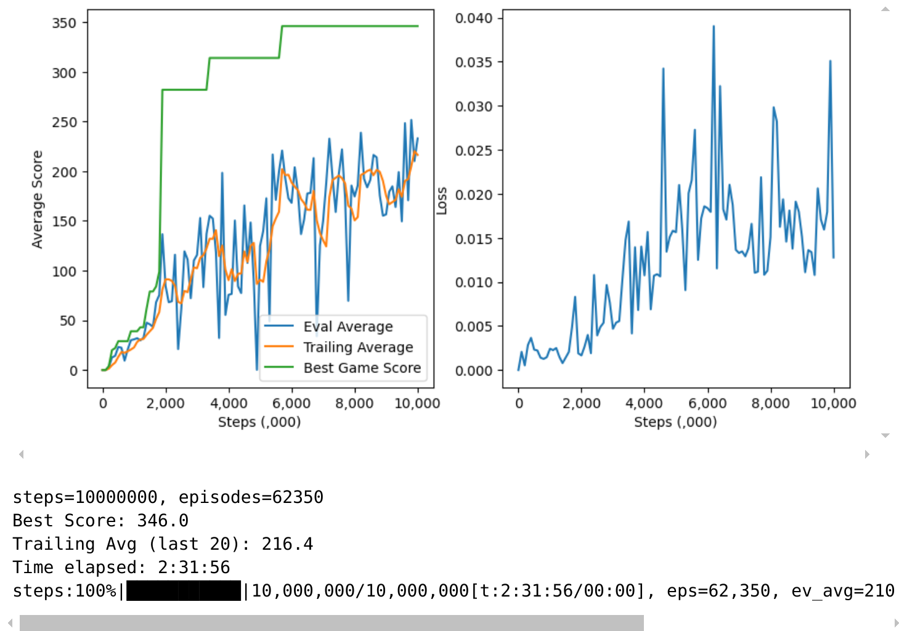

## Vectorized, Customizable Rainbow DQN
A highly flexible implementation for applying "rainbow DQN methods" to *Atari 2600* games using `gymnasium's` vectorized environments.  I built this mostly ground up to understand the evolving algorithms and fine tune various hyperparameters. I also wanted to explore speed tradeoffs with vectorization a 24-core processor and an RTX-4090 GPU.

#### Basic use
Parameters are passed by dictionary, then passed to the parameter handler. Each parameter has a default value (below). 
```python
  p = dict(
      name=                   'DDQN',
      env_name =              'BreakoutNoFrameSkip-v4',
      dueling=                False,
      noisy_linear=           False,
      categorical_DQN=        False,
      prioritized_replay=     False,
      n_step_learning=        False,
      screen_size=            42,
      memory_size=            1_000_000,
      eval_interval=          100_000,
      max_steps=              20_000_000, 
      record_interval=        10_000_000, 
      n_games_per_eval=       5,
      n_envs=                 16,
      group_training_losses=  True,
    )
  dqn = DQN(p)
  dqn.train()
```

At `evalation_interval` steps, the evaluator simulates `n_games_per_eval` games (all lives) and updates the plots:
<div style="width: auto; height: calc(100% - 13px); overflow: hidden;">
  
</div>

#### Logging
Parameters, checkpoints, videos, and evaluation histories are all saved to or updated in the `[log_dir]/[name]` directory, based on parameter settings.    

#### Memory
The replay buffer takes the most memory.  The main constraint is the replay buffer.  Memory use is `memory_size` $ \times ($`screen_size`$^2)  \times 5$.  The default setting of $1,000,000 \times 84 \times 84 \times 5 \sim 35$ GB.  We delete the memory buffer on exiting the training loop to avoid an out of memory crash if, e.g., multiple instances of `DQN` are opened in the notebook.

#### Vectorization
##### *Parallel environments*
The training loop uses `gymnasium`'s vectorzed environment structure. The original *DeepMind* algortith performs a policy update every 4 steps, on a batch of $32$ transitions taken from the replay buffer.  In a vectorized environment, we need to adjust:  If `n_envs` $=1$, we perform a policy update every 4 steps.  If `n_envs` $= 4$, we perform a policy update each step. However, if `n_envs` $= 8$, we perform two updates of $32$ each step and, similarly, if `n_envs`=16 we perform four batch updates of $32$ each step.  The effect of training multiple batches consecutively (i.e., out of turn) becomes irrelevant as a large memory buffer is filled.
##### *Option to grouping the backward passes for large `n_envs`*
If the `n_envs` parameter is $ \geq 4 $ and if the `group_training_losses == True`, the policy update will accumulate the loss over multiple forward passes and train on the average backward pass. For example, if `n_envs ==` 16, it will conduct $16 \div 4 = 4 $ forward passes, accumulate the losses, then conduct $1$ backward pass on $1/4$ of that accumulated loss tensor.

**Note:**
The `gymnasium` vectorized environments, as the `n_envs` increase, don't appear to produce significant speed increases.  Using Intel I9 (24 cores) and NVIDIA RTX 4090.  I tested up to 32 threads, but the speed increase was diminishing.  I was not running this on an isolated machine, so other processes were likely interfering.
- **Basic DQN**: 16 vectorized environments vs single environment: 20-22% faster.
- **Rainbow DQN**: 16 vectorized environments vs single environment: 25-29% faster.

#### Environment wrappers
I've created custom `gymnasium` wrappers that likely exist. I've also used a few `gymnasium`-compatible wrappers from the `stable_baselines3` library.

1. `five_stack`: stores each state / new state in a combined 5 frame stack observation, such that [:4] is the *state* and [1:] is the *next_state*.
2. `fire_on_life_loss`: the original **DeepMind** algorithim used a 5% epsilon for evaluation mode to avoid games getting stuck.  For example, games like `breakout` that require a `FIRE` command to restart after each life lost will pause indefinitely if we use a pure `argmax` policy that returns an action other than `FIRE`.  This wrapper, if used, automatically triggers a fire when a life is lost, allowing us to lower the epsilon closer to zero to rely solely on the policy's best actions.  In many games the difference won't matter.
3. `noop_reset` allows for a range of noop_steps upon a reset.
4. `set_seed`: to seed single or vectorized environments.  In my implementation the same seed is applied as the random and numpy seed (although vectorized seeds are increments of the given seed)

#### Screen size
The standard approach resizes the default color screen (210,160,3) to b&w (84,84).  But for certain "boxy" games (e.g., **Breakout**), (42,42) works as well, allowing a 75% reduction in memory. I haven't run exact like-for-like comparisons nor have I run tests using 42x42 frame size on a wide range of Atari games.  The modification from the *DeepMind* convolutional layer format is constructed by altering the kernel and stride on the first convolutional layer:
```python
    # Adjust the kernal and stride for conv layer 1 based on screen size
    assert (screen_size in [42, 84]), "Screen size must be 42 or 84"
    kernel1, stride1 = (8, 4) if screen_size == 84 else (4, 2)

    # Define convolutional layers
    conv1 = nn.Conv2d(in_channels=4,  out_channels=32, kernel_size=kernel1, stride=stride1)
    conv2 = nn.Conv2d(in_channels=32, out_channels=64, kernel_size=4, stride=2)
    conv3 = nn.Conv2d(in_channels=64, out_channels=64, kernel_size=3, stride=1)
```

#### Comparing results
To graph results from all runs in the log folder:
```python
from modules.utils import plot_multiple_results
plot_multiple_results([log_dir], names, col)
```

#### Video
Videos are periodically recorded by setting the `record_interval` parameters.  Set to `None` if no video needed.

#### To-dos / Future updates 
- **Tensorboard**: Move the monitoring of progress to a tensorboard to avoid the need to run experiments in Jupyter. 
- **Checkpoint playback or training resumption**: Policy checkpoints are currently saved, but no the environment or other training data.  So there is currrently no way to run a simulation from the checkpoint, nor is there a way to resume training from a checkpoint.

#### Set-up
These steps build the environment as of October 2024, but the dependencies have been changing, so I haven't included an environment file.  
Please check the `Gymnasium` docs at the [Farama Foundation]('https://gymnasium.farama.org/') if this doesn't work.  The `RecordVideo` wrapper requires `moviepy`. 
```bash
conda create -n my_atari_env -c conda-forge python=3.10 pytorch numpy swig tqdm -y
pip install gymnasium[atari,accept-rom-license] moviepy
```

For `Gymnasium`-compatible wrappers from `stable-baselines3`:
```bash  
pip install stable-baselines3   
```


#### Default options
You can edit the default parameters directly in the `default_parameters.py` file or pass them in when instantiating a `DQN` object:
```python    
  SimpleNamespace(

    # Rainbow DQN Flags
    doubleQ=                   False,
    dueling=                   False,
    categorical_DQN=           False,
    noisy_linear=              False,
    prioritized_replay=        False,
    n_step_learning=           False,

    # Vectorization Parameters
    n_envs=                    8,
    group_training_losses=     False,

    # Environment Parameters
    asynchronous=             False,
    seed=                     0,
    env_name=                 "BreakoutNoFrameskip-v4",
    screen_size=              84,
    noop_min=                 10,
    noop_max=                 10,
    fire_on_life_loss=        False,

    # Device
    device=                   torch.device('cuda'),

    # Model Parameters
    memory_size=              1_000_000,
    batch_size=               32,
    random_starts=            50_000,
    learning_rate=            0.0000625,
    gradient_clamping=        True,
    gamma=                    0.99,
    scale_around_zero=        False,
    fc1_out=                  512,

    # Experimental Parameters
    batch_norm=               False,
    layer_norm=               False,

    # Epsilon Parameters
    epsilon_start=            1.0,
    epsilon_final=            0.1,
    epsilon_decay_steps=      1_000_000,
    eval_epsilon=             0.05,

    # Interval Parameters
    policy_update_interval=   4,
    pbar_update_interval=     100,
    target_update_interval=   10_000,
    eval_interval=            50_000,
    n_games_per_eval=        10,
    checkpoint_interval=      2_500_000,
    record_interval=         None,

    # Exit Conditions
    max_steps=               20_000_000,
    exit_trailing_average=   10_000,
    exit_time_limit=        1200,  # Time in minutes

    # Rainbow Parameters
    # Categorical DQN Parameters
    atom_size=               51,
    Vmin=                    -10,
    Vmax=                    10,

    # Priority Replay Parameters
    alpha=                   0.6,
    beta_start=              0.4,
    beta_frames=             100_000,
    pr_epsilon=              1e-5,

    # N-step Learning Parameters
    n_steps=                 3,
    n_memory_size=           500,
    n_gamma=                 0.99,

    # Logging Parameters
    main_log_dir=            'logs',
    group_dir=               '[no group name]',
    video_dir=               'videos',
    name=                    '[no name]',
    note=                    '[no note]',
    overwrite_previous=      False,
    data_logging=            True,
    data_plotting=           False,
    trailing_avg_trail=      20,
)
  ```

#### Citations / acknolowledgements / licenses:
If you use ideas from this work, please cite these papers:
1. Mnih, V., Kavukcuoglu, K., Silver, D., Rusu, A. A., Veness, J., Bellemare, M. G., ... & Hassabis, D. (2013). *Playing Atari with Deep Reinforcement Learning*, [arXiv:1312.5602](https://arxiv.org/abs/1312.5602)  
2. Hessel, M., Modayil, J., Van Hasselt, H., Schaul, T., Ostrovski, G., Dabney, W., ... & Silver, D. (2017). *Rainbow: Combining Improvements in Deep Reinforcement Learning*,[arXiv:1710.02298](https://arxiv.org/abs/1710.02298). This paper integrates several key advancements in deep reinforcement learning, including:
<small>
- **Double Q-Learning** ([*Deep Reinforcement Learning with Double Q-learning*](https://arxiv.org/abs/1509.06461), Van Hasselt et al., 2015)   
  
- **Prioritized Experience Replay** ([*Prioritized Experience Replay*](https://arxiv.org/abs/1511.05952), Schaul et al., 2015)  
  
- **Dueling Network Architectures** ([*Dueling Network Architectures for Deep Reinforcement Learning*](https://arxiv.org/abs/1511.06581), Wang et al., 2015)  
  
- **Multi-step Learning** ([*Multi-step Reinforcement Learning: A Unifying Algorithm*](https://arxiv.org/abs/1703.01327), De Asis et al., 2017)  
  
- **Distributional RL** ([*A Distributional Perspective on Reinforcement Learning*](https://arxiv.org/abs/1707.06887), Bellemare et al., 2017)  
  
- **Noisy Nets** ([*Noisy Networks for Exploration*](https://arxiv.org/abs/1706.10295), Fortunato et al., 2017)  
</small>

For coding, understanding, and inspiration, I relied on the following:
<small>
1. Wetlui's basic [DQN implementation](https://github.com/wetliu/dqn_pytorch) was a great starting point for this project. 
2. Curt Park's repository [rainbow-is-all-you-need](https://github.com/Curt-Park/rainbow-is-all-you-need) was helpful in understanding the underlying concepts of each of the rainbow methods.
</small>

Also, thanks to:
- [Farama Foundation](https://gymnasium.farama.org/) for producing, maintaining, `gymnasium` environments, documentation, and libraries.
- [stablebaselines3](https://github.com/DLR-RM/stable-baselines3) for maintaining the `stable-baselines3` libraries and wrappers available.
- *Atari 2600 ROMs*, under the [atari-roms](https://github.com/mattgrose/atari-roms) repository. See licensing.